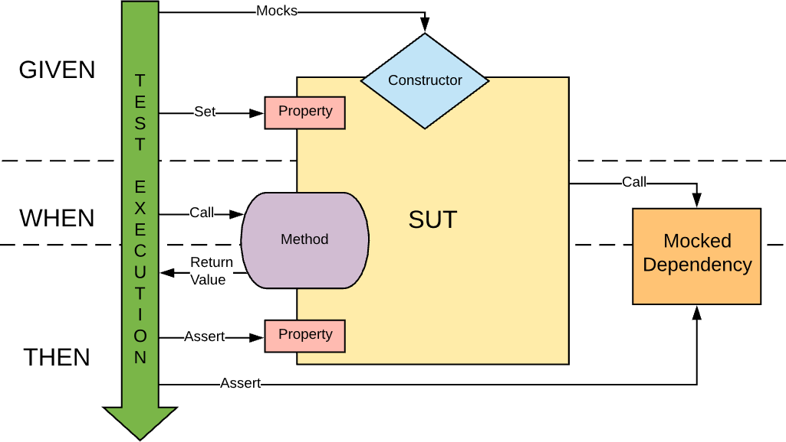

<style>
  /* Adds styling for codeblocks to add line numbers with custom engine */
  /* Based on: https://github.com/orgs/marp-team/discussions/164 */
  pre ol {
      all: unset;
      display: grid;
      grid-template-columns: auto 1fr;
      counter-reset: line-number 0;
    }
    pre ol li {
      display: contents;
    }
    pre ol li span[data-marp-line-number]::before {
      display: block;
      content: counter(line-number) " ";
      counter-increment: line-number;
      text-align: left;
      color: #bbb; /* Lighter color for line numbers */
      font-weight: lighter; /* Lighter font weight for line numbers */
    }
  /* Centered text */
  .centered {
    text-align: center;
  }
  /* Fixed top */
  .fixed-top {
    position: absolute;
    top: 10%;
  }
  /* For sources of citations */
  .source {
    font-size: 12px;
  }
</style>


# Datenschutz/-sicherheit

### und die Notwendigkeit von Tests

von Kevin Böhme und Rico Ukro

---

<!--TODO: Delete this slide-->

# TODO

- [ ] Reorder slides
- [ ] Make this stuff beautiful
- [ ] Check Abbreviations
- [ ] Discuss: \
       - Use Mentimeter (or similar) opinion poll?
          Questions: Do you regularly test your software? Will you change your testing habits after this presentation?
      - Create interactive quiz? (e.g. Kahoot)
- [ ] Collect all inline quotes

---

## Agenda

- Was sind Tests?
- Warum Tests?
- Grundlagen von Tests und Testverfahren
  - Unit Tests
  - Integration Tests
  - Penetration Tests
  - System Tests
  - Fuzzing
- Testverfahren für Datensicherheit im Detail
- Datenschutz: Besonderheiten beim Testen
   <!-- TODO: idea: No real data, generated data, eventually from a public database for this purpose -->
- Quellen

---

<style scoped>
 ul { list-style-type: none; }
</style>

<h1 class="centered">
  Was sind Tests?
</h1>

* > _&#8222;Software testing is the process of evaluating and verifying that a software product or application does what it’s supposed to do. The benefits of good testing include preventing bugs and improving performance.&#8220;_ <br><span class="source">Quelle: [https://www.ibm.com/topics/software-testing](https://www.ibm.com/topics/software-testing)</span>


<!-- - Evaluierung und Verifizierung von Software -->
<!-- - Verhindern von Fehlern -->
<!-- - Verbesserung der Performance -->

---

TODO: Erst gesetzlich oder erst technisch? -- Langweiligeres zuerst?

--- 
## Warum Tests? 

##### Aus technischer Sicht
TODO: Python or js ? &rArr; Consistence

```javascript
let response = fetch("https://api.example.com/data");

if (typeof response === "undefined") {
  // Handle error
} else {
  // Handle response
}
```

```python
response = requests.get("https://api.example.com/data")

if response.status_code != 200:
    # Handle error
else:
    # Handle response
```

- Warum ist Testing in diesem Kontext wichtig?

---

<h1 class="centered">
  Warum Tests?
</h1>

---

<h2 class="fixed-top">
  Gesetzliche Anforderungen (DSGVO)
</h2>

- Geeignete technische und organisatorische Maßnahmen
- Schutz personenbezogener Daten durch Tests
- Sicherstellung der System- und Datensicherheit

---

<h2 class="fixed-top">
   Artikel 5 – Grundsätze der Verarbeitung
</h2>

- Angemessene Sicherheit sicherstellen
- Schutz vor unbefugter Verarbeitung und Datenverlust

> _&#8222;in einer Weise verarbeitet werden, die eine angemessene Sicherheit der personenbezogenen Daten gewährleistet [...] durch geeignete technische und organisatorische Maßnahmen („Integrität und Vertraulichkeit“);&#8220;_ <span class="source">Quelle: [Artikel 5 Abs. 1(f) DSGVO](https://dsgvo-gesetz.de/art-5-dsgvo/)</span>

---

<h2 class="fixed-top">
  Artikel 25 – Datenschutz durch Technikgestaltung
</h2>

- **Privacy by Design**: Datenschutz in der Entwicklung berücksichtigen
- Systeme vor Einführung testen

> _&#8222;[...] trifft der Verantwortliche [...] geeignete technische und organisatorische Maßnahmen – wie z. B. Pseudonymisierung –, die dafür ausgelegt sind, die Datenschutzgrundsätze wie etwa Datenminimierung wirksam umzusetzen und die notwendigen Garantien in die Verarbeitung aufzunehmen, um den Anforderungen dieser Verordnung zu genügen und die Rechte der betroffenen Personen zu schützen.&#8220;_ <span class="source">Quelle: [Artikel 25 Abs. 1 DSGVO](https://dsgvo-gesetz.de/art-25-dsgvo/)</span>

---

<h2 class="fixed-top">
  Artikel 32 – Sicherheit der Verarbeitung
</h2>

- Regelmäßige Tests vorgeschrieben
- Vertraulichkeit, Integrität und Verfügbarkeit sicherstellen
- Systeme und Prozesse evaluieren

> _&#8222;Ein Verfahren zur **regelmäßigen** Überprüfung, Bewertung und Evaluierung der Wirksamkeit der technischen und organisatorischen Maßnahmen zur Gewährleistung der Sicherheit der Verarbeitung.&#8220;_ <span class="source">Quelle: [Artikel 32 Abs. 1(f) DSGVO](https://dsgvo-gesetz.de/art-32-dsgvo/)</span>

---

<h1 class="centered">
  Grundlagen von Tests und Testverfahren
</h1>

---

<h2 class="fixed-top">
 Überblick über Testarten
</h2>

- Notwendig um Fehler in Software zu finden
- Verschiedene Testarten decken unterschiedliche Aspekte ab:
  - Funktionalität
  - Integration
  - Sicherheit
- Verbindung zum Datenschutz:
  - Sicherstellen, dass keine personenbezogenen Daten kompromittiert werden

---

<h2 class="fixed-top">
  Unit Tests
</h2>

- Testen einzelner Softwarekomponenten
- Ziel: Sicherstellen, dass jede Komponente isoliert korrekt funktioniert
- Wichtig für Datenschutz: Vermeidung unsicherer Funktionen/Klassen in Modulen

> _&#8222;Software unit testing is a process that includes the performance of test planning, the acquisition of a test set, and the measurement of a test unit against its requirements.&#8220;_ <span class="source">Quelle: [IEEE Standard for Software Unit Testing]()</span>

---

<h2 class="fixed-top">
  Unit Tests
</h2>

<div class="centered">
  
</div>

<div class="centered source">

  Quelle: [https://dancerscode.com/posts/unit-tests/](https://dancerscode.com/posts/unit-tests/)
</div>

---

---

---

## Quellen

- _[Placeholder](www.example.com)_
